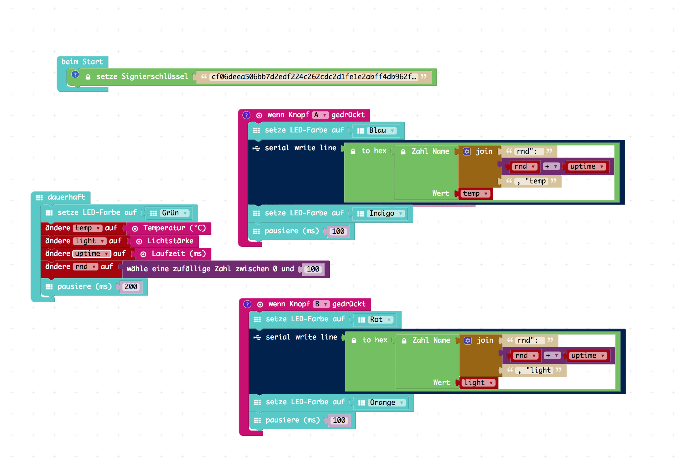
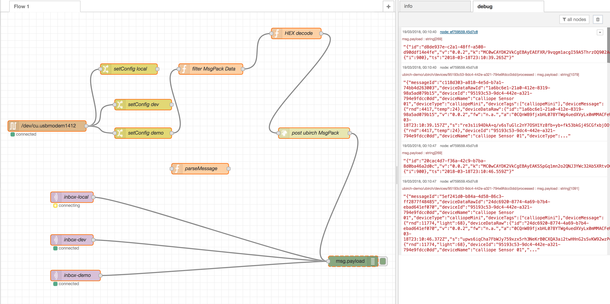

# ubirch Calliope Demo

Calliope / NodeRed based demo project to play with signed [ubirchProtocol](https://github.com/ubirch/ubirch-protocol) messages.

# Calliope PXT

[Calliope Sensor](./src/mini-calliSignedSensor.hex)

# NodeRed

[NodeRed Flow](./src/mini-calliSignedSensor_nodered.json)

# Licence

[Apache License 2.0](./LICENSE)